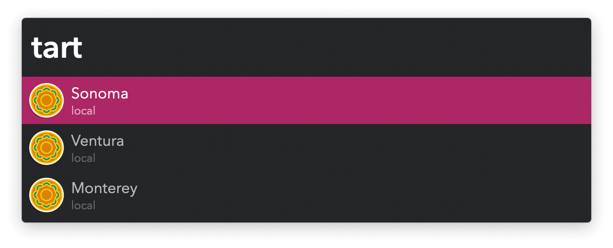

#  Virtual Machines Alfred Workflow

Run and Manage Virtual Machines

<a href='https://alfred.app/workflows/vitor/virtual-machines'>⤓ Install on the Alfred Gallery</a>

## Setup

Install your virtual machines with [`tart`](https://github.com/cirruslabs/tart).

## Usage

Search installed virtual machines via the List VMs Keyword (default: `tart`).

* <kbd>⏎</kbd>: Run.
* <kbd>⌘</kbd><kbd>⏎</kbd>: Overwrite with another. <kbd>⌘</kbd><kbd>⏎</kbd> again to restart the original.
* <kbd>⌥</kbd><kbd>⏎</kbd>: Clone.
* <kbd>⌃</kbd><kbd>⏎</kbd>: Delete.
