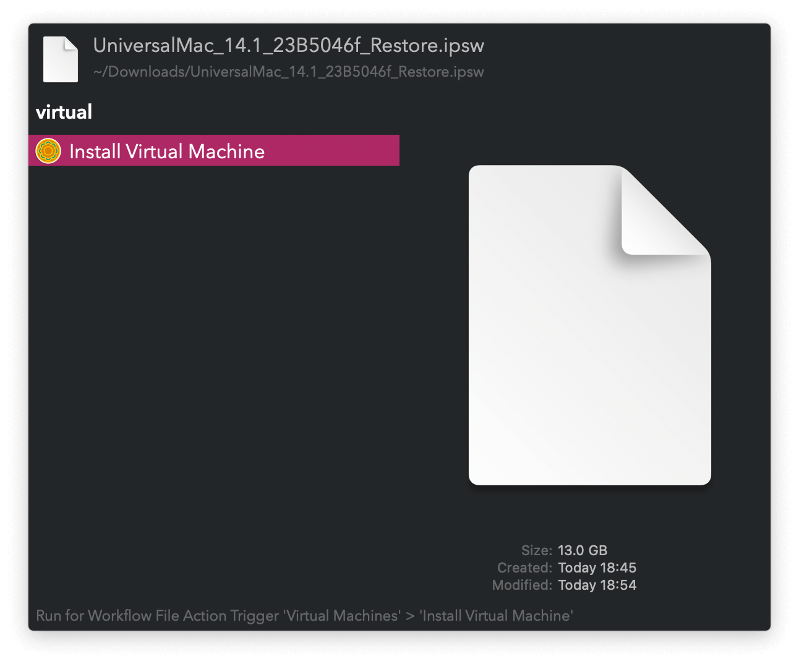

#  Virtual Machines Alfred Workflow

Run and Manage Virtual Machines

[⤓ Install on the Alfred Gallery](https://alfred.app/workflows/vitor/virtual-machines)

## Setup

Install [`tart`](https://github.com/cirruslabs/tart) with `brew install cirruslabs/cli/tart` and use it to install your virtual machines. You can install Apple Device Software Update Files (`.ipsw`) via the [Universal Action](https://www.alfredapp.com/help/features/universal-actions/).

## Usage

Search installed virtual machines via the `tart` keyword. List VMs ignored from the main list with the `itart` keyword.

* <kbd>↩&#xFE0E;</kbd>: Run virtual machine.
* <kbd>⌘</kbd><kbd>↩&#xFE0E;</kbd>: Overwrite with another. <kbd>⌘</kbd><kbd>↩&#xFE0E;</kbd> again to restart the original.
* <kbd>⌥</kbd><kbd>↩&#xFE0E;</kbd>: Clone. <kbd>⌘</kbd><kbd>↩&#xFE0E;</kbd> when naming to start the new one.
* <kbd>⌃</kbd><kbd>↩&#xFE0E;</kbd>: Delete.
* <kbd>⇧</kbd><kbd>↩&#xFE0E;</kbd>: Ignore or Unignore.
* <kbd>fn</kbd><kbd>↩&#xFE0E;</kbd>: Switch between Main and Ignored lists.
